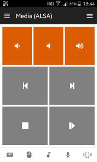

# Media (ALSA)
A Media remote that controls volume using the ALSA mixer rather than the media keys.
This is useful in situations where the media keys don't work.

## Features
Same as the default Media remote.

## Requirements
* ALSA with `amixer` command line utility

## Links
* [Download](https://github.com/cifkao/unified-remote-media/archive/master.zip)
* [How To Install a Custom Remote](https://www.unifiedremote.com/tutorials/how-to-install-a-custom-remote)
* [GitHub](https://github.com/cifkao/unified-remote-media)
